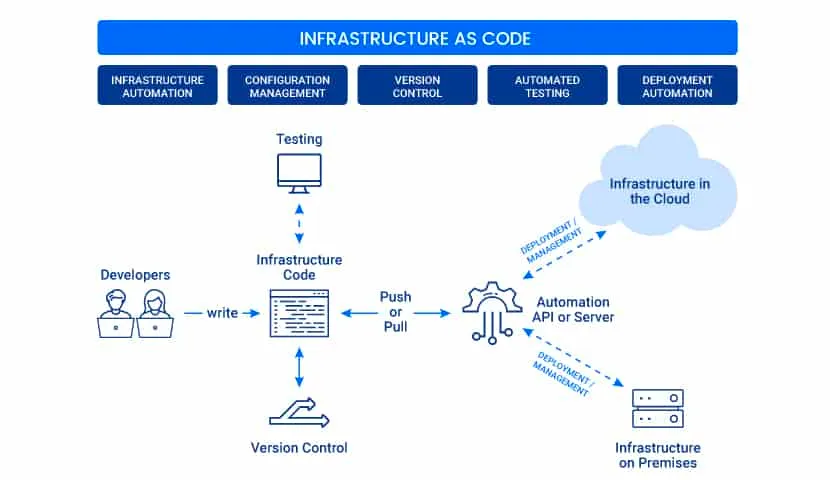
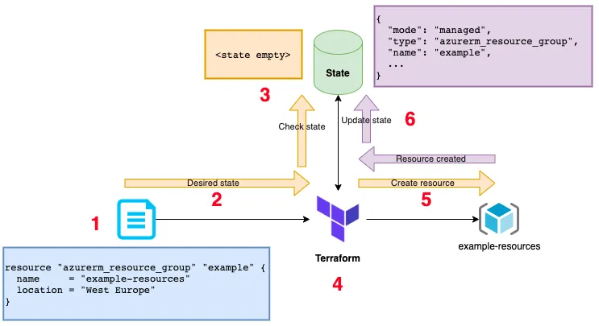

## Terraform 101

[Terraform 101: Deploy Your First Infrastructure as Code](https://medium.com/@SaiParvathaneni/terraform-101-deploy-your-first-infrastructure-as-code-ccd762fdd72)

- "Provisioning cloud infrastructure" refers to the process of setting up and configuring computing resources, storage, networking, and other services in a cloud computing environment to meet specific requirements or demands. This involves allocating and configuring virtual servers, databases, networking components, and other resources within a cloud provider's infrastructure.

- HCL: HashiCorp Configuration Language

- Terraform allow users to provision, manage and deploy cloud infrastructure in a simple way

- Features: Platform agnostic, Version Control, Modular and reusable, Predictable changes

## Terraform 101
[Terraform 101](https://medium.com/@harshityadav95/terraform-101-b0c8fb704df4)

- *Terraform Key Concepts*
    - Variables: Input as parameters, output is the returned value.  variables are used to parameterize and customize your infrastructure configurations. They allow you to define values that can be reused throughout your Terraform configuration files, making your infrastructure code more flexible and easier to maintain.

            z.b.variable "region" {
        description = "The AWS region where resources will be provisioned."
        default     = "us-east-1"
        }

    - Providers: a "provider" is a plugin that allows Terraform to interact with a specific cloud, infrastructure, or service provider. Providers are responsible for understanding API interactions and exposing resources that can be managed by Terraform

    - Module: Terraform configuration files

    - State: Record what infrastructure has been created 

    - Resources: various services provided by cloud providers

    - Data source: a "data source" is a way to fetch and use information from outside of your configuration. While resources in Terraform represent infrastructure that you create and manage (such as virtual machines, networks, etc.), data sources are a means to fetch existing data from a service or provider.

    - Plan: determines what needs to be created, updated, or destroyed to move from the real/current state of the infrastructure to the desired state.

    - Apply: it applies the changes real/current state of the infrastructure in order to achieve the desired state

- *Terraform State*
  - first check if our resource first exists in State (whether it has been created already)
  - check with Azure to ensure that the actual state matches what it expects to find
  - Reconciliation: Terraform reconciles desired state into the actual state.

- *CRUD*
    - Create, Update, Delete
    - 
    - Terraform does not know anything about provisioned resources in your Cloud Provider unless it’s in the State

- *LifeCycle*
    - Initialization: initialize working directory containing config files, determine Providers needed, initialize state if not existing
    - Planning : This command instructs Terraform to parse our HCL files, build a graph of our resources, check its state and attempt to come up with an execution plan to perform; output of the plan can be saved into a file and used for the next step apply 
    - Apply: Execution of all the planned operations
    
